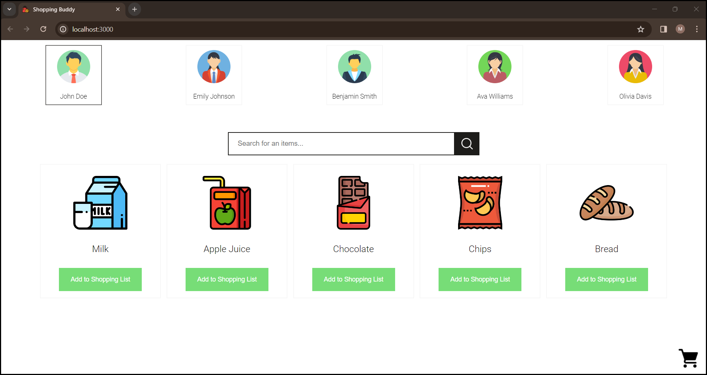
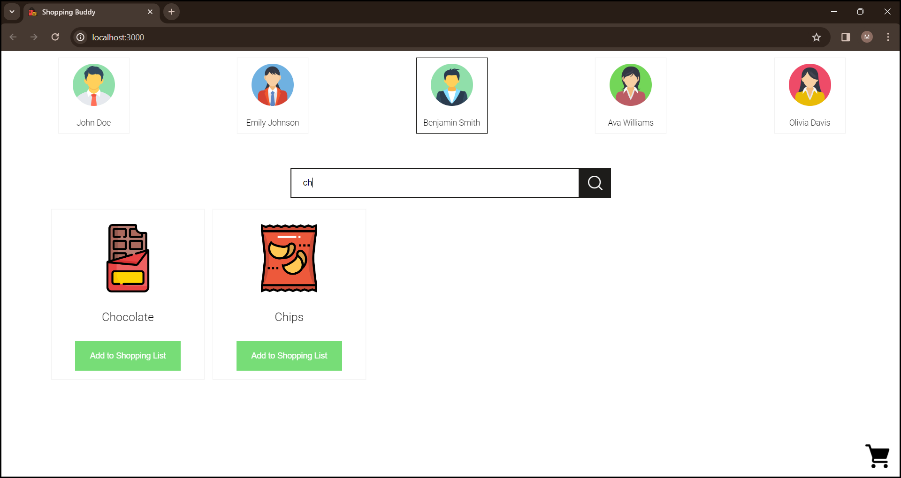
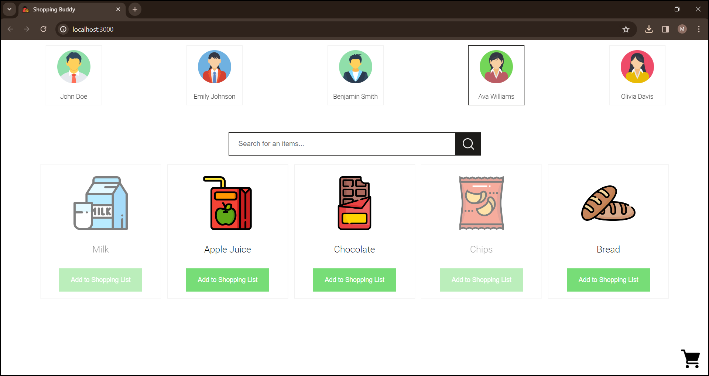
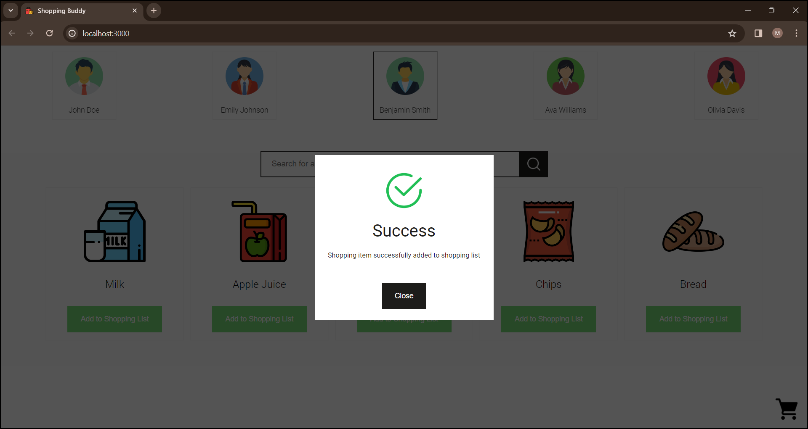
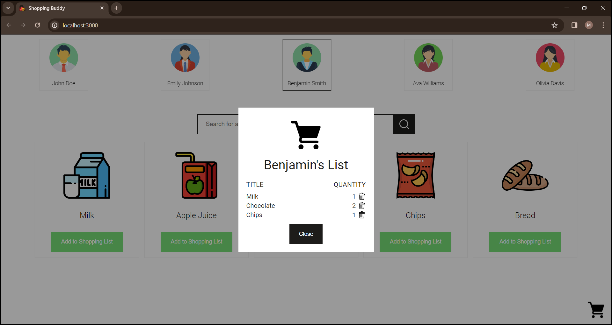

<br />
<div align="center">
  <a href="https://github.com/mkokor/shopping-buddy">
    
  </a>
  <h3 align="center">Shopping Buddy</h3>
  <p align="center">
    An awesome shopping assistant web application!
    <br />
    <a href="https://github.com/mkokor/shopping-buddy/#readme"><strong>Explore the docs »</strong></a>
    <br />
    <br />
    <a href="https://github.com/mkokor/shopping-buddy/#demonstration">View Demo</a>
    ·
    <a href="https://github.com/mkokor/shopping-buddy/issues">Report Bug</a>
    ·
    <a href="https://github.com/mkokor/shopping-buddy/issues">Request Feature</a>
  </p>
</div>

<details>
  <summary>Table of Contents</summary>
  <ol>
    <li>
      <a href="#about-the-project">About The Project</a>
      <ul>
        <li><a href="#demonstration">Demonstration</a></li>
      </ul>
    </li>
    <li>
      <a href="#getting-started">Getting Started</a>
      <ul>
        <li><a href="#installation">Installation</a></li>
        <li><a href="#execution">Execution</a></li>
      </ul>
    </li>
  </ol>
</details>


# About the Project
<p align="justify">
This repository contains the source code of a full-stack web application for shopping assistance. The frontend was implemented using React.js, and the backend was implemented using .NET 7.
The code is divided into 2 main folders:
</p>

*  "./ShoppingBuddyApi" - backend;
*  "./shopping-buddy-app" - frontend.


## Demonstration


https://github.com/mkokor/shopping-buddy/assets/126569077/0c2b3231-f96f-4e29-ae21-6e1f882e5ebd


### Home
<div align="center">
  
</div>

### Search
<div align="center">
  
</div>

### Unavailable shopping item
<div align="center">
  
</div>

### Success
<div align="center">
  
</div>

### Shopping list
<div align="center">
  
</div>


# Getting Started
<p align="justify">
Follow the instructions bellow to get local copy up and running.
</p>

## Prerequisite
1. Local <a href="https://dev.mysql.com/downloads/mysql/">MySQL</a> server
2. <a href="https://dotnet.microsoft.com/en-us/download/dotnet/7.0">.NET 7 SDK</a>
3. <a href="https://nodejs.org/en">Node.js</a>

## Installation
1. Clone the repository with the following git cli command
```bash
git clone https://github.com/mkokor/shopping-buddy.git
```
2. Get your local <a href="https://dev.mysql.com/downloads/mysql/">MySQL</a> server up and running at port 3306 and make sure to enable following credentials
```json
{
  "user": "root",
  "password": "password"
}
```
3. Make sure you have installed dotnet-ef tool
```bash
dotnet tool install --global dotnet-ef
```
4. Run following cli command inside of "./ShoppingBuddyApi/ShoppingBuddy.API" folder to apply database migration
```bash
dotnet ef database update
```
5. Run following cli command inside of "./shopping-buddy-app" folder install required NPM packages
```bash
npm install
```

## Execution
<p align="justify">
Run command below inside of "./ShoppingBuddyApi/ShoppingBuddy.API" folder to start the backend.
</p>

```bash
dotnet watch run
```

<p align="justify">
Run command below inside of "./shopping-buddy-app" folder to start the frontend.
</p>

```bash
npm start
```

<p align="justify">
After startup, application can be accessed on following domains:
</p>

* http://localhost:5122/swagger/index.html - API Swagger UI;
* http://localhost:3000/ - application home page.
